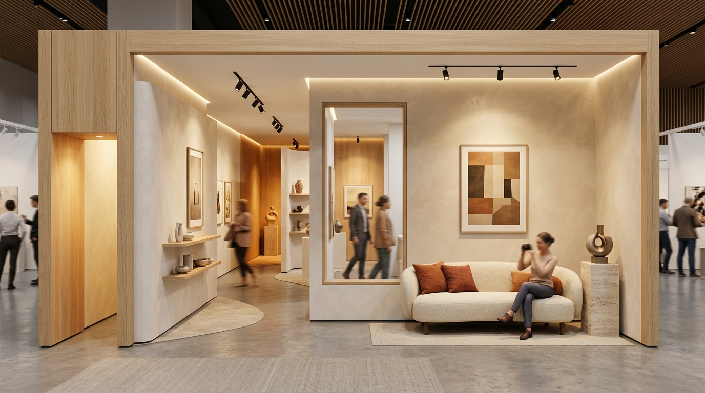
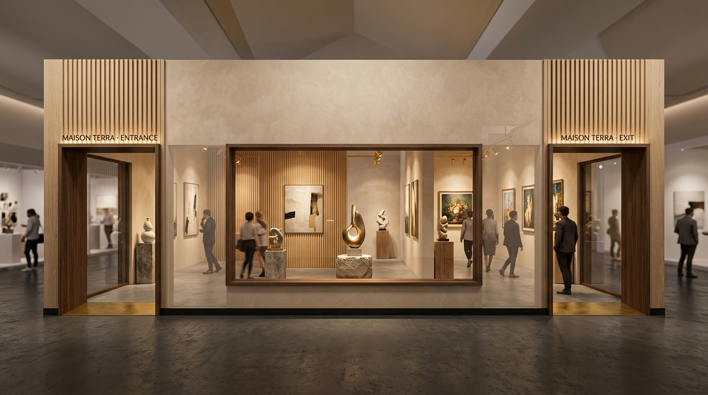
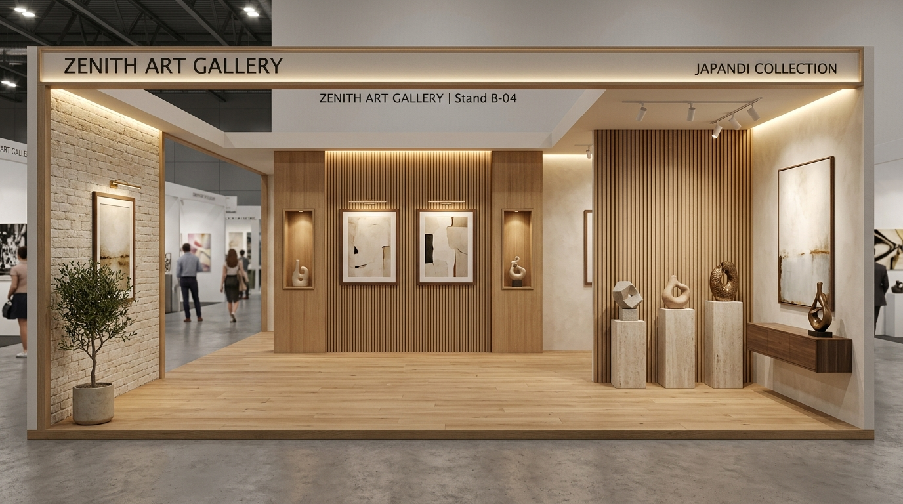

# Warm Wood Living Room — 3D Exhibition Booth & Pavilion (15 × 3 m)

แบบจำลอง 3 มิติเชิงโต้ตอบ (Interactive 3D Architectural Mockup) ของบูธนิทรรศการและแกลเลอรี ขนาด **หน้ากว้าง 15.00 เมตร × ความลึก 3.00 เมตร (ความสูงโครงสร้าง 3.00 เมตร)** ตกแต่งในธีม **Warm Wood Living Room & Japandi Art Pavilion**



---

## 🌟 จุดเด่นและฟังก์ชันหลัก (Key Features)

### 1. 🏛️ ซุ้มทางเข้า-ออก และหน้าต่างสถาปัตยกรรม (Portals & Windows)
- **🚪 ทางเข้าอยู่ฝั่งซ้าย (Left Entrance · 1.50 m):** ช่องประตูทางเข้ากว้าง 1.50 เมตร สูง 2.45 เมตร กรอบไม้ Solid Walnut คิ้วทองเหลืองซาติน และป้ายไฟเรืองแสง `MAISON TERRA · ENTRANCE`
- **🚪 ทางออกอยู่ฝั่งขวา (Right Exit · 1.50 m):** ช่องประตูทางออกกว้าง 1.50 เมตร สูง 2.45 เมตร สร้างเส้นทางเดินแบบ **One-Way Circulation** ที่ลื่นไหล
- **🪟 หน้าต่างส่องชมภายใน (Architectural Peek Window · 3.20 m):** หน้าต่างกระจกสถาปัตยกรรมตรงกลางหน้ากากอาคาร ให้ผู้คนที่เดินผ่านภายนอกสามารถชำเลืองมองเห็นประติมากรรม S2 ผนังระแนงไม้โอ๊ค และบรรยากาศภายในบูธ

### 2. 📸 มุมถ่ายรูปไฮไลท์ (Signature Photo Spot)
- **🛋️ โซฟาดีไซเนอร์ (Designer Bouclé Curved Sofa):** โซฟานั่งพักผ่อนโครงไม้จริงหุ้มผ้านุ่ม Warm Oat Bouclé โค้งมน พร้อมหมอนอิงสี Terracotta และ Olive
- **🗿 ประติมากรรม S3 ข้างแขนโซฟา:** วางบนแท่นหิน Travertine สูง 0.76 ม. ชิดข้างแขนซ้ายของโซฟาพอดี อยู่ในระดับสายตาและไหล่ของผู้ที่นั่ง เหมาะสำหรับการถ่ายรูปคู่ผลงานศิลปะ (Museum Portrait)
- **💡 แสงไฟ Studio Portrait:** สปอตไลท์สตูดิโอ Warm White ส่องตรงลงบนโซฟาและประติมากรรม พร้อมภาพวาดผืนผ้าใบ P4 เป็นฉากหลัง

### 3. 🌿 ผนังกั้นห้องแบบ Asymmetric (Staggered Layout)
- **ผนังกั้น 1 (ห้อง 1 ไปห้อง 2 · $X = -2.60\text{ ม.}$):** ผนังทึบอยู่ฝั่งหลัง ($Z = 0 \dots 1.75\text{ ม.}$) และช่องทางเดินเปิดฝั่งหน้า ($Z = 1.75 \dots 2.96\text{ ม.}$)
- **ผนังกั้น 2 (ห้อง 2 ไปห้อง 3 · $X = +2.40\text{ ม.}$):** ผนังทึบสลับมาอยู่ฝั่งหน้า ($Z = 1.20 \dots 2.96\text{ ม.}$) และช่องทางเดินเปิดฝั่งหลัง ($Z = 0 \dots 1.20\text{ ม.}$)
- สร้างการเดินชมงานศิลปะแบบคดเคี้ยว (Meandering S-Curve Flow) ที่เป็นธรรมชาติและทำให้พื้นที่ดูกว้างขวางมีมิติ

### 4. 🔮 ผนังโปร่งใสทะลุจางพิเศษ (Ultra-Sheer See-Through Mode)
- สวิตช์ **Checkbox ผนังโปร่งใสทะลุ (See-Through / X-Ray)** ปรับความจางลงเหลือเพียง **3.5% (`opacity: 0.035`)**
- ซ่อนระแนงไม้ภายนอกและคานเพดานอัตโนมัติ เพื่อให้มองทะลุเห็นผังภายใน ชิ้นงานศิลปะ และเฟอร์นิเจอร์ได้อย่างชัดเจน 100%
- แถบ **Slider ปรับระดับความจางได้อิสระ (1% – 15%)**

### 5. 🎨 จุดจัดแสดงศิลปะครบครัน (6 Sculptures & 4 Paintings)
- **🗿 ประติมากรรม 6 ชิ้น (ความสูง 50 ซม.):**
  - **S1:** แท่นหิน Travertine ในห้อง 1 (West Gallery)
  - **S2:** แท่นหิน Travertine ตรงกลางห้อง 2 ตรงกับหน้าต่างส่องชม
  - **S3:** แท่นหินอ่อนเคียงข้างโซฟามุมถ่ายรูปในห้อง 3 (Photo Lounge)
  - **S4, S5:** ภายในซุ้ม Niche บิลท์อินติดไฟ LED อบอุ่นในห้อง 3
  - **S6:** บนตู้ไซด์บอร์ดไม้วอลนัทท็อปหินอ่อนในห้อง 2
- **🖼️ ภาพวาดติดกรอบ 4 ภาพ:**
  - **P1:** ผนังอิฐ Limestone Brick ห้อง 1 ($0.95 \times 1.25\text{ ม.}$)
  - **P2, P3:** ผนังระแนงไม้โอ๊คห้อง 2 ($0.95 \times 1.25\text{ ม.}$)
  - **P4:** ภาพวาดผืนผ้าใบใหญ่ฉากหลังโซฟามุมถ่ายรูป ห้อง 3 ($1.40 \times 0.90\text{ ม.}$)

### 6. 📦 ระบบนำเข้าไฟล์ 3D โมเดล (Custom 3D Object Support)
- รองรับการลากวาง (Drag & Drop) หรืออัปโหลดไฟล์โมเดล 3D นามสกุล:
  - **`.glb`**, **`.gltf`**, **`.obj`**, **`.fbx`**
- ระบบคำนวณ Bounding Box และปรับสเกลอัตโนมัติ (Auto-scale) ให้สูง **50 ซม.** พร้อมแถบสเกลเลื่อนปรับขนาดได้ตั้งแต่ 10 – 150 ซม.
- Gizmo 3D Control สำหรับคลิกเลื่อนตำแหน่ง (Translate) หรือหมุนองศา (Rotate)
- ปุ่มลัด **"ย้ายไปแท่นโชว์"** นำโมเดลไปวางตรงหน้าต่างส่องชมทันที

---

## 📸 ภาพตัวอย่างสถาปัตยกรรม (Gallery Renders)

| หน้ากากอาคาร (เข้าซ้าย · หน้าต่างกลาง · ออกขวา) | ทางเดินภายใน แสงคมชัด |
| :---: | :---: |
|  |  |

---

## 🚀 วิธีเปิดใช้งาน (Getting Started)

โครงงานนี้พัฒนาด้วย **Vanilla HTML, CSS, JavaScript (ES Modules)** และ **Three.js** ไม่จำเป็นต้อง build bundle:

### วิธีที่ 1: รันด้วย Python HTTP Server
```bash
# รันเซิร์ฟเวอร์จำลองบนพอร์ต 5173 หรือ 8080
python3 -m http.server 5173
```
เปิดเบราว์เซอร์ไปที่: `http://localhost:5173`

### วิธีที่ 2: รันด้วย Node.js (npx serve / vite)
```bash
npx -y serve .
```

---

## 🎮 การควบคุมมุมมอง (Camera & Controls)

- **คลิกซ้าย + ลาก:** หมุนมุมกล้องรอบบูธ (Orbit Rotate)
- **Scroll Wheel:** ซูมเข้า / ซูมออก (Zoom In / Out)
- **คลิกขวา + ลาก:** เลื่อนระนาบมุมมอง (Pan)
- **ปุ่มลัดมุมมองด่วน (Camera Quick Views):**
  - `📸 มุมถ่ายรูป (Sofa)`: บินกล้องเข้ามาที่ระดับสายตาตรงหน้าโซฟามุมถ่ายรูป
  - `ด้านหน้าตรง`: ดูมุมมองด้านหน้าอาคาร (เข้าซ้าย - หน้าต่าง - ออกขวา)
  - `🚪 ทางเข้าซ้าย (1.5m)`: ซูมดูซุ้มประตูทางเข้าฝั่งซ้าย
  - `🪟 ส่องผ่านหน้าต่าง`: มองส่องผ่านกระจกหน้าต่างเข้าไปในห้องกลาง
  - `🚪 ทางออกขวา (1.5m)`: ซูมดูซุ้มประตูทางออกฝั่งขวา
  - `🚶 ทางเดินในห้อง`: เดินจำลองในห้องตามเส้นทาง Asymmetric
  - `มุมบน (Floor Plan)`: มุมมองแปลนพื้น Top-Down 90 องศา

---

## 🛠️ เทคโนโลยีที่ใช้ (Tech Stack)

- **Three.js (r160)** — WebGL 3D Rendering Engine
- **OrbitControls & TransformControls** — ระบบควบคุมกล้องและการย้ายโมเดล 3 มิติ
- **GLTFLoader, OBJLoader, FBXLoader** — ตัวอ่านไฟล์โมเดล 3 มิติ
- **CSS2DRenderer** — แสดงป้าย Dimension และ Label ชิ้นงานศิลปะแบบโต้ตอบ
- **EffectComposer & UnrealBloomPass** — การจัดแสงเงาและ Post-Processing แบบ Clean Museum Grade
